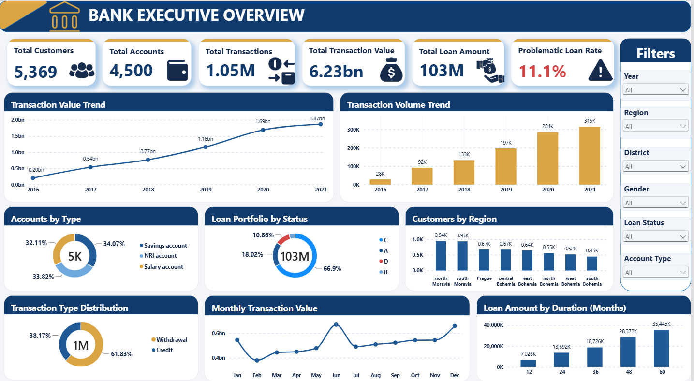
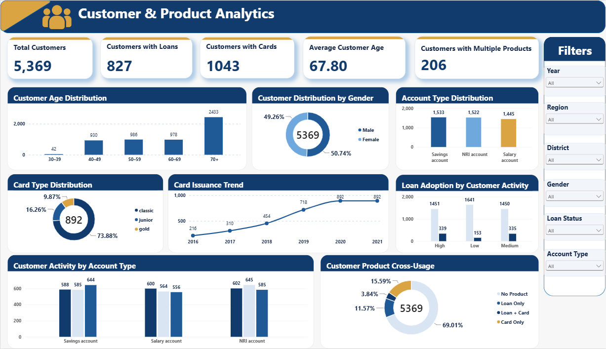
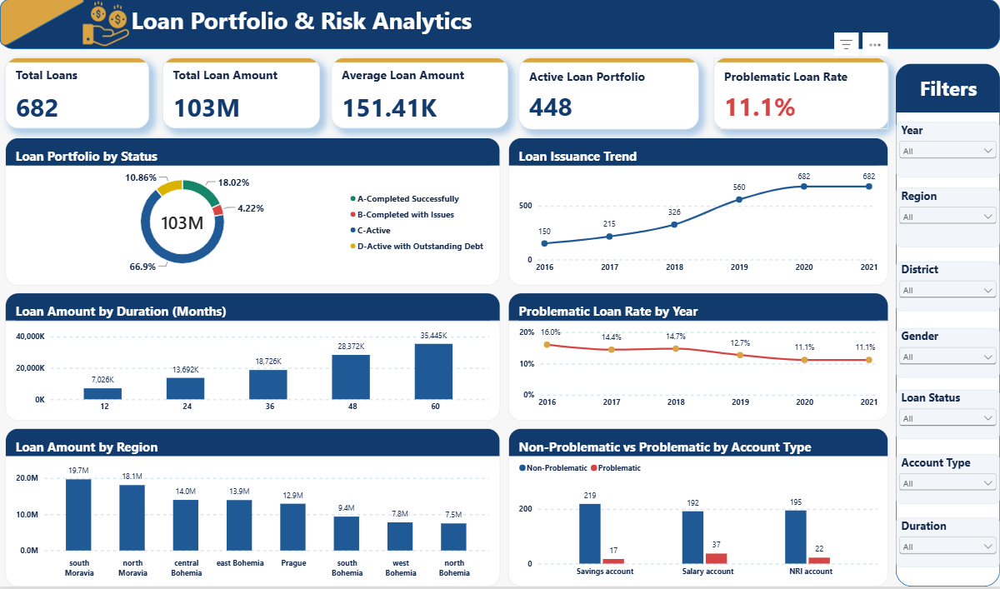
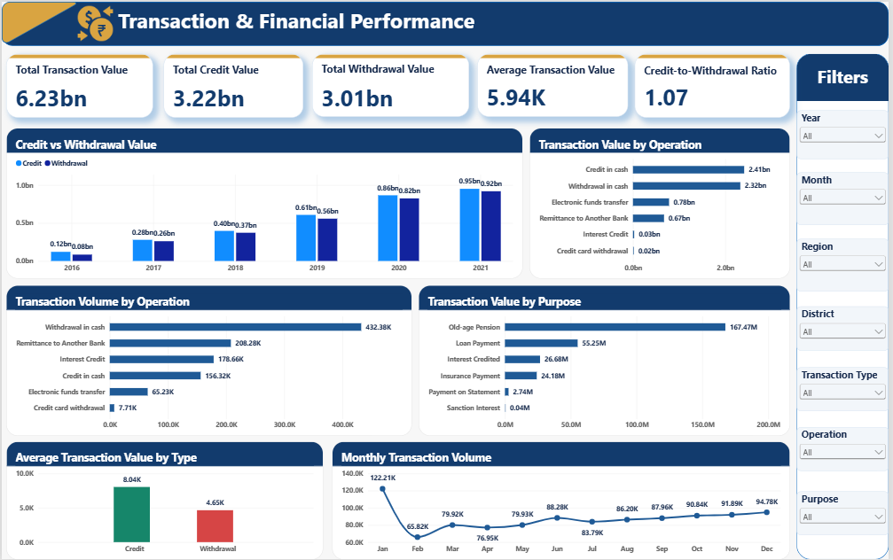
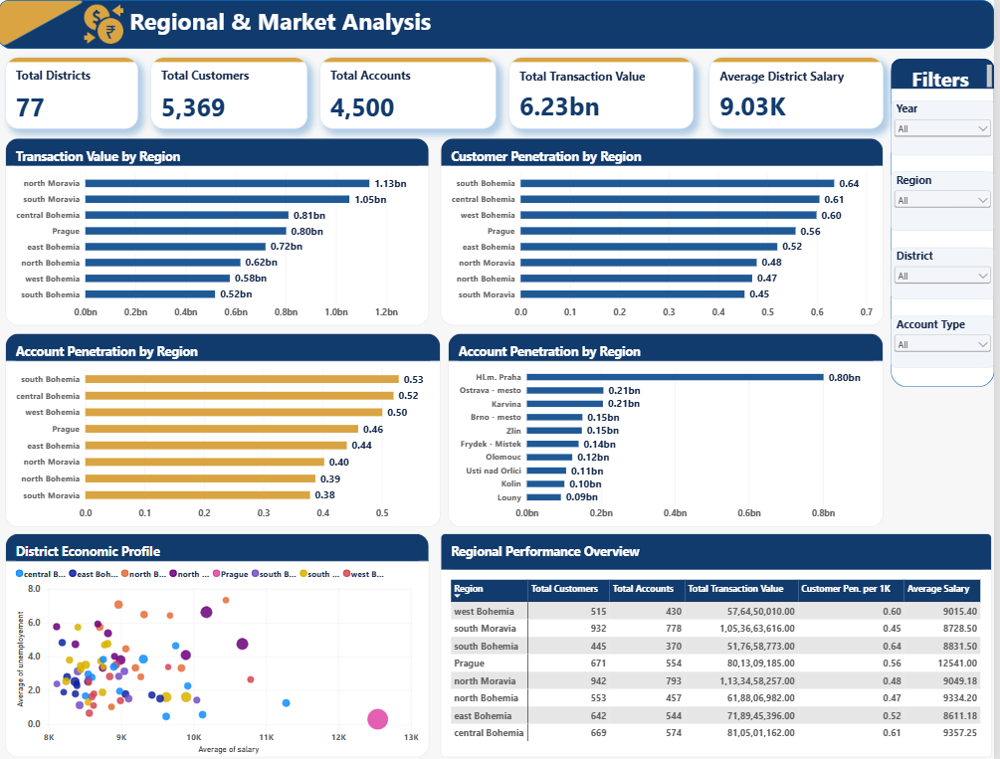

# Banking Analytics — Czechoslovakia Bank

> End-to-end banking analytics project using SQL Server, Python and Power BI.

## Project Overview

This project analyzes banking data to understand:

- Customer behavior
- Transaction & financial performance
- Product adoption
- Loan portfolio & risk
- Regional banking performance

The project follows a complete Data Analyst workflow:

**SQL Audit → Validation → Python Analysis → Customer 360 → Power BI → Business Insights**

## Tools

- SQL Server
- Python
- Pandas
- NumPy
- Matplotlib
- Seaborn
- Power BI

---

## Project Highlights

- ~1M transaction records analyzed
- 5,369 customers
- 4,500 accounts
- 682 loans
- Customer 360 analysis
- 5 interactive Power BI dashboards
- SQL-based data audit & validation
- Python-based data cleaning & EDA
- Customer behavioral analysis
- Loan portfolio & risk analysis
- Transaction & financial performance analysis
- Regional & district-level analysis
- Card and product adoption analysis

---

## Dashboard Preview

### 01. Bank Executive Overview



**Key Insights**
- Transaction activity increased substantially across the available years.
- Withdrawal transactions represent the largest share of transaction volume.

---

### 02. Customer & Product Analytics



**Key Insights**
- Customer activity varies across Low, Medium and High activity segments.
- Loan adoption differs across customer activity segments.
- Card adoption represents a smaller share of the overall customer base.
- Customer product cross-usage shows customers holding both loan and card products.

---

### 03. Loan Portfolio & Risk Analytics



**Key Insights**
- The loan portfolio contains both active and completed loan categories.
- 76 of 682 loans fall under the project's problematic B+D status grouping.
- Problematic loan rates vary across loan issuance years.
- Loan portfolio size and distribution differ across regions and account types.

---

### 04. Transaction & Financial Performance



**Key Insights**
- Withdrawal transactions have higher transaction volume than credit transactions.
- Transaction value is concentrated across major banking operations.
- Transaction activity increased substantially across the available years.
- Credit and withdrawal values show different patterns across the analysis period.

---

### 05. Regional & Market Analysis



**Key Insights**
- Banking transaction value varies considerably across regions and districts.
- Customer and account penetration differs across regions after population normalization.
- A small group of districts contributes a significant share of transaction activity.
- District-level salary and unemployment provide additional context for regional performance.

---

## Project Structure

```text
sql/
├── 01_Data_Audit.sql
├── 02_Data_Validation.sql
└── 03_Customer_360.sql

python/
├── 01_Data_Cleaning.ipynb
└── 02_Data_EDA.ipynb

powerbi_screenshots/
├── 01_Bank_Executive_Overview.png
├── 02_Customer_Product_Analytics.png
├── 03_Loan_Portfolio_Risk_Analytics.png
├── 04_Transaction_Financial_Performance.png
└── 05_Regional_Market_Analysis.png
```

## Author

**Rahul Verma**  
BCA | Aspiring Data Analyst / Data Scientist
